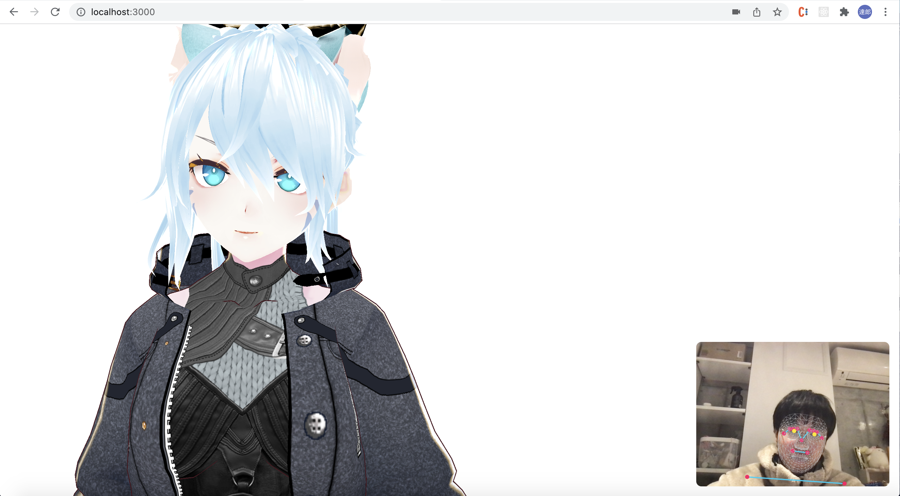

## Summary
samples for explaining how to use kalidokit modules

## Install
```
git clone https://github.com/softmurata/kalidokitsample.git
```
```
npm install
```

## Run Command
```
npm start
```

please go to http://localhost:3000

